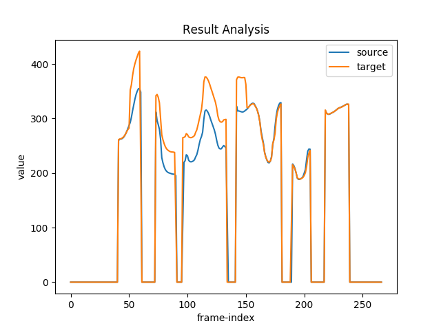

代码测试

### 测试音频

​<audio id="audio" controls="" preload="none">
      <source id="wav" src="https://github.com/Liu-Feng-deeplearning/Liu-Feng-deeplearning.github.io/blob/master/audio/x.wav">
</audio>

### 测试图像

### 测试图像2

### 测试图像-居中对齐

xx

{:height="50%" width="50%"}

